# Telecommunication Company Churn Analysis-Classification Model
# Introduction
 Customer attrition is one of the biggest expenditures of any organization. Customer churn otherwise known as customer attrition or customer turnover is the percentage of customers that stopped using your company's product or service within a specified timeframe.
For instance, if you began the year with 500 customers but later ended with 480 customers, the percentage of customers that left would be 4%. If we could figure out why a customer leaves and when they leave with reasonable accuracy, it would immensely help the organization to strategize their retention initiatives manifold.


-  *Attached are articles to my project with more information.*
## Summary
| Article     | Links      | Description |
|-----------|-------------|:-------------:|
|Power BI| https://app.powerbi.com/view?r=eyJrIjoiNWRlMDhhYzMtMGJkZi00OTQzLWI0MTItZGJmODJjYWVlYjE3IiwidCI6IjQ0ODdiNTJmLWYxMTgtNDgzMC1iNDlkLTNjMjk4Y2I3MTA3NSJ9 |  [Interactive dashboard](/) |
|Medium   | https://medium.com/@phinmaiyo/telecommunication-company-churn-analysis-classification-model-a190f9ce6518                         |  [ Best article to gain machine-learning insights                        ](/) |

## Project Description

- In this project, we aim to find the likelihood of a customer leaving the organization, the key indicators of churn as well as the retention strategies that can be implemented to avert this problem.

## Exploratory Data Analysis: EDA

### Univariate Analysis 

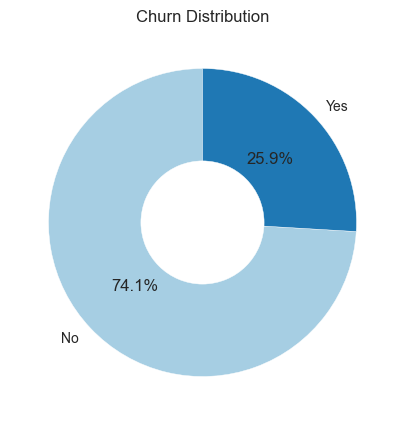

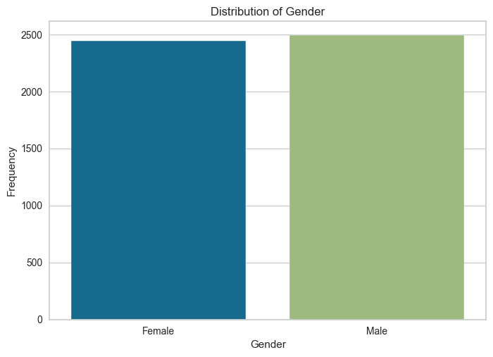

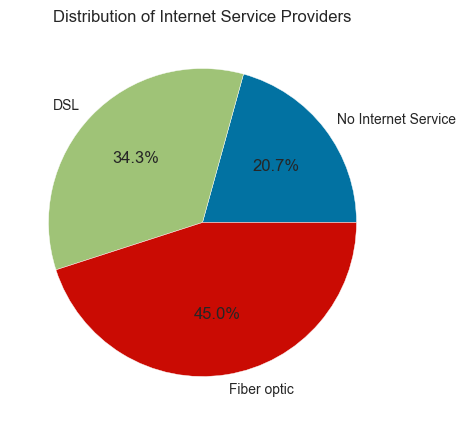

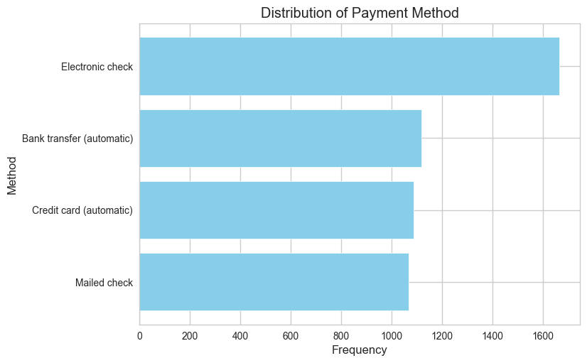

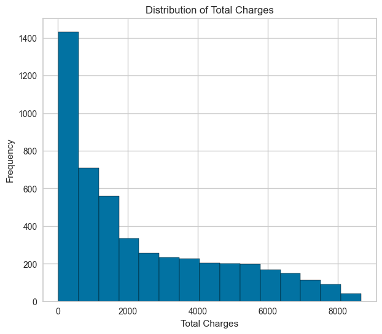

### Multivariate Analysis 

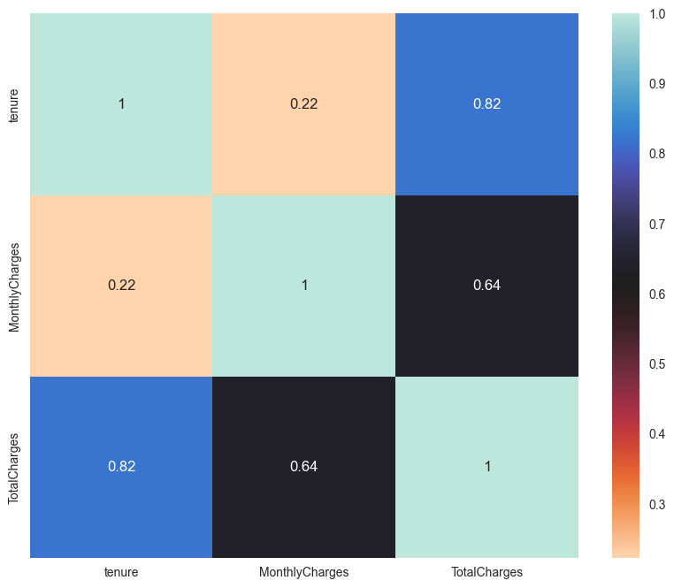

## Hypothesis development 

✨ NULL: Contract type does not influence customer churn

✨ ALTERNATE: Contract type affects customer churn

based on chi-square test, we observe that the p-value is less than alpha, hence we reject Ho and conclude that is there is a statistical significance association between Churn and Contract.

## Business questions
1. How does gender impact customer churn? 

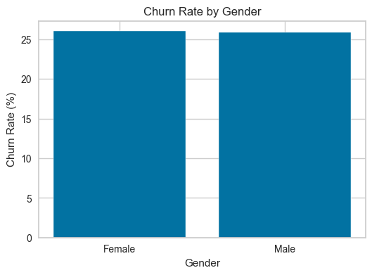

2. Does the presence of a partner or dependents influence customer churn? 

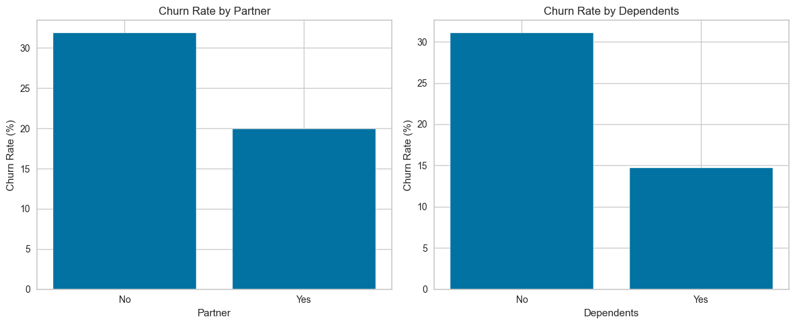

3. How does the length of tenure affect churn rates? 

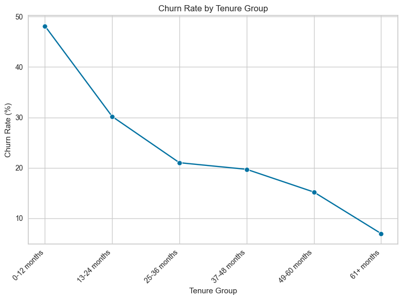

4. What role do additional services (e.g., online security, tech support, streaming TV, etc.) play in reducing customer churn? 

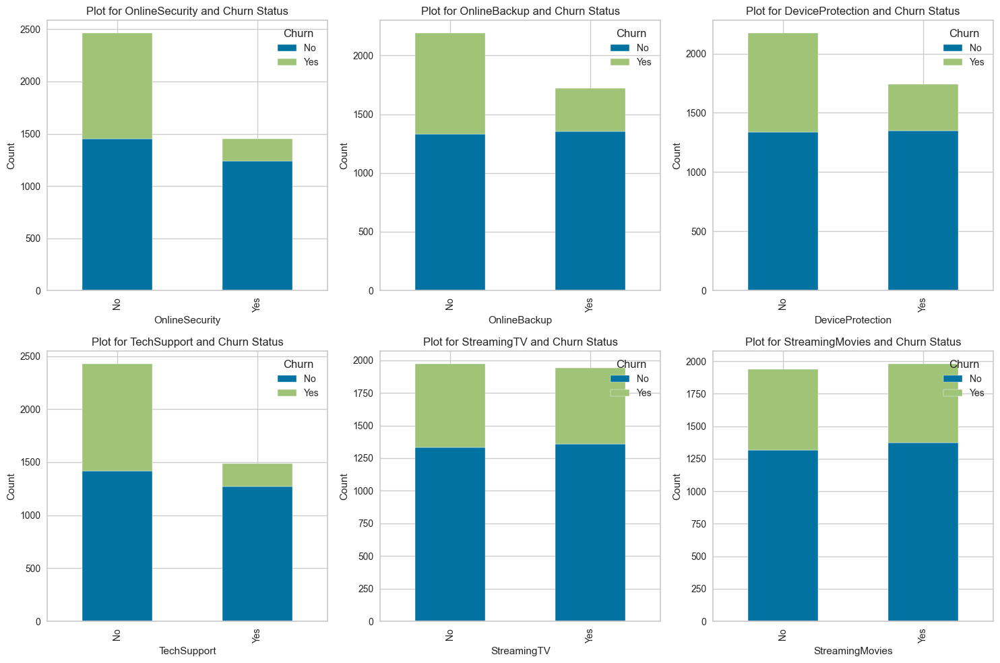

5. Is there a correlation between the contract term (month-to-month, one year, two years) and churn rates? 

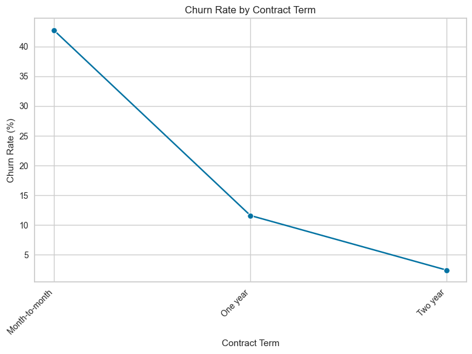

## Setup

Follow these steps to set up the project on your local machine:

1. **Clone the repository:**
  ```bash
   git clone https://github.com/your-username/Telco-Churn-Analysis.git

2. Navigate to the project directory:
  cd Telco-Churn-Analysis

3. Install required dependencies:
  pip install -r requirements.txt

4. Download the dataset:
  Download the Telco Churn dataset from the datasets folder and place it in the data directory. 

5. Run the analysis:
  Depending on your preferred IDE or notebook environment, open and run the provided Jupyter Notebook or Python scripts. 

6. Evaluate models:
  After training and tuning models, evaluate them using the evaluation dataset. You can use the provided evaluation script or notebook.

7. Export the best model:
  If desired, export the best trained model using the provided export script.

## App Execution